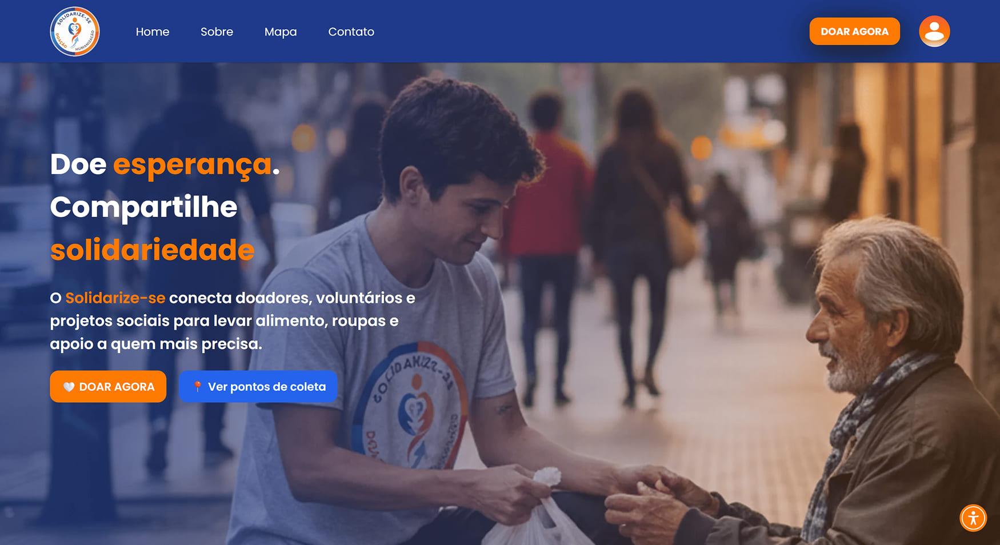
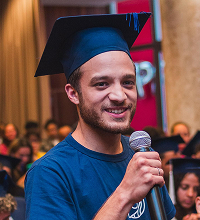
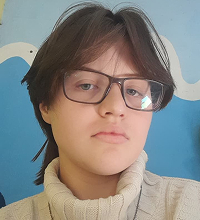
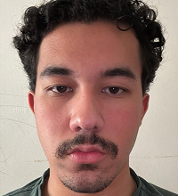
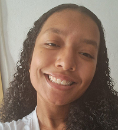
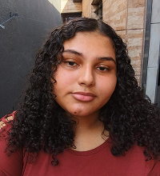
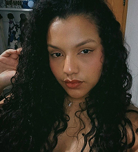

[HTML__BADGE]: https://img.shields.io/badge/html5-000000?style=for-the-badge&logo=html5
[CSS__BADGE]: https://img.shields.io/badge/css3-000000?style=for-the-badge&logo=css
[JAVASCRIPT__BADGE]: https://img.shields.io/badge/javascript-000000?style=for-the-badge&logo=javascript
[PROJECT__BADGE]: https://img.shields.io/badge/📱Veja_o_projeto-000?style=for-the-badge&logo=project
[PROJECT__URL]: https://solidarize-se.vercel.app/

# Solidarize-se 🤝

![html][HTML__BADGE]
![css][CSS__BADGE]
![javascript][JAVASCRIPT__BADGE]

[](https://creativecommons.org/licenses/by-nc-nd/4.0/)

[](./assets/SolidarizeSePage.jpg)

## 📌 Sobre

O **Solidarize-se** é uma plataforma web com a finalidade de conectar doadores com quem precisa, mais especificamente moradores de rua.

A proposta do projeto é atuar como uma ponte entre doações (que são adquiridas pela iniciativa) e um programa de voluntariado, permitindo que pessoas se cadastrem na plataforma para ajudar diretamente na causa.

O projeto foi desenvolvido utilizando `HTML5`, `CSS3` e `JavaScript`.

[![project][PROJECT__BADGE]][PROJECT__URL]

## 🤔 Como rodar esse projeto no seu computador?

Para clonar e rodar esse projeto no seu computador, você precisará ter o [Git](https://git-scm.com/) instalados no seu computador. Após isso, siga os passos a seguir pelo terminal do seu computador:

```bash
# Clone esse repositório
$ git clone https://github.com/Solidarize-se-PROA/Front-End.git

# Navegue até o diretório principal do projeto
$ cd front-end

# Abra o projeto pelo arquivo index.html no seu navegador
```

## ✍ Créditos

Esse projeto incorpora imagens e ícones das seguintes fontes:

- [Freepik](https://br.freepik.com/)
- Imagens geradas por IA (ChatGPT e Gemini)

## 🎨 Criadores

<table>
  <tr>
    <td align="center">
        <br>
        <sub>
          <b>Matheus Matos</b>
          <br />
          <a href="#" title="Programação">💻</a>
        </sub>
    </td>
    <td align="center">
        <br>
        <sub>
          <b>Matheus Júnior</b>
          <br />
          <a href="#" title="Programação">💻</a>
        </sub>
    </td>
    <td align="center">
        <br>
        <sub>
          <b>Rafael Rocha</b>
          <br />
          <a href="#" title="Programação">💻</a>
        </sub>
    </td>
    <td align="center">
        <br>
        <sub>
          <b>Samuel Sousa</b>
          <br />
          <a href="#" title="Programação">💻</a>
        </sub>
    </td>
    <td align="center">
        <br>
        <sub>
          <b>Jéssica Santos</b>
          <br />
          <a href="#" title="UI/UX Design">🎨</a>
        </sub>
    </td>
    <td align="center">
        <br>
        <sub>
          <b>Jhenifer Rayssa</b>
          <br />
          <a href="#" title="UI/UX Design">🎨</a>
        </sub>
    </td>
    <td align="center">
        <br>
        <sub>
          <b>Stephanie Almeida</b>
          <br />
          <a href="#" title="UI/UX Design">🎨</a>
        </sub>
    </td>
    <td align="center">
        <br>
        <sub>
          <b>Yasmin Vale</b>
          <br />
          <a href="#" title="UI/UX Design">🎨</a>
        </sub>
    </td>
  </tr>
</table>

## 📝 Licença

Esse projeto está licenciado sob a Licença [Creative Commons Attribution-NonCommercial-NoDerivatives 4.0 International](https://creativecommons.org/licenses/by-nc-nd/4.0/)
